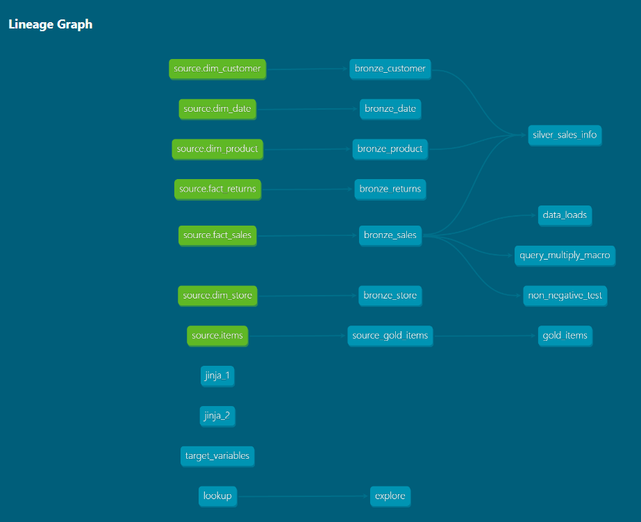

# 🚀 dbt Fundamentals: The Transformation Engine
  

  
  
  
  

---

## 📖 Project Overview
This repository is a **technical showcase** of dbt Core fundamentals. I transformed raw, normalized data into a high-performance **One Big Table (OBT)** architecture, ensuring a seamless experience for downstream BI tools.

Instead of just writing SQL, I treated data like **software code**, implementing testing, version control, and historical tracking.

---

## 📊 Lineage Graph

---

## 🎯 The dbt Toolkit (Fundamentals Covered)

| Feature | Implementation |
| :--- | :--- |
| **🔄 Snapshots** | Captured **SCD Type 2** history for evolving source data. |
| **🧪 Testing** | Deployed **Generic & Custom tests** to ensure 100% data integrity. |
| **🤖 Macros** | Built **Jinja-powered macros** to automate repetitive SQL filters. |
| **🌱 Seeds** | Ingested static business mappings via CSV for instant lookup. |
| **📚 Docs** | Generated a searchable **Data Dictionary** and lineage graph. |

---

## 🏗️ Data Architecture
I followed a modular approach to build the final dataset:

1. **Staging Layer**: Standardizing types, renaming columns, and basic cleaning.
2. **Intermediate/Core**: Joining multiple entities into a **de-normalized Wide Table**.
3. **Analytics Layer**: The "Ready-to-Consume" data model for reporting.

  

